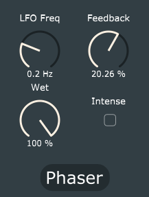

# Phaser

Phaser-effect plugin made with JUCE. The phaser is a gray box model of the Frame Sweet Tone Phaser PH-10 1, with a second order IIR-filter working as a DC blocker and ten allpass filters. The effect allows the conrol of:
- LFO freq: The frequency of the LFO modulating the phase response of the allpass filters
- Feedback: The gain of the allpass-filter feedback path.
- Mix: The ratio between the wet and dry signal.
- Intensity: OFF = full-wave rectified sinewave, ON = triangular waveform.

		
	

## References
[1] Kiiski, Roope, Fabián Esqueda, and Vesa Välimäki. "TIME-VARIANT GRAY-BOX MODELING OF A PHASER PEDAL."
